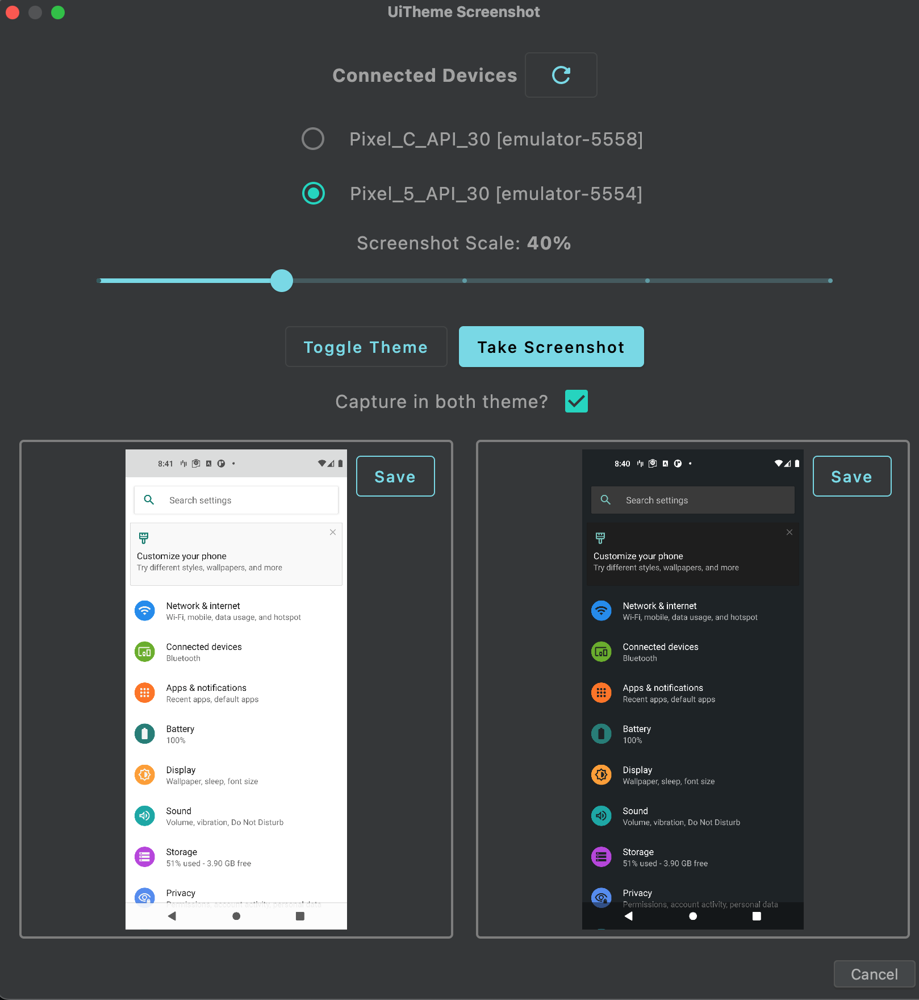

# Android-UiTheme-Screenshot
Android Studio and Intellij IDEA plugin develop by compose-multiplatform.  

Easily capture screenshots from your connected Android device using adb. You can obtain both dark mode and light mode screenshots in one go.
## Features
- Select target from multiple connected devices
- Switch themes (Light/Dark) with a single button and capture screenshots for both
- Save screenshot functionality</li>

## Usage
You can find in the following menu `Tools->UiTheme Screenshot`

